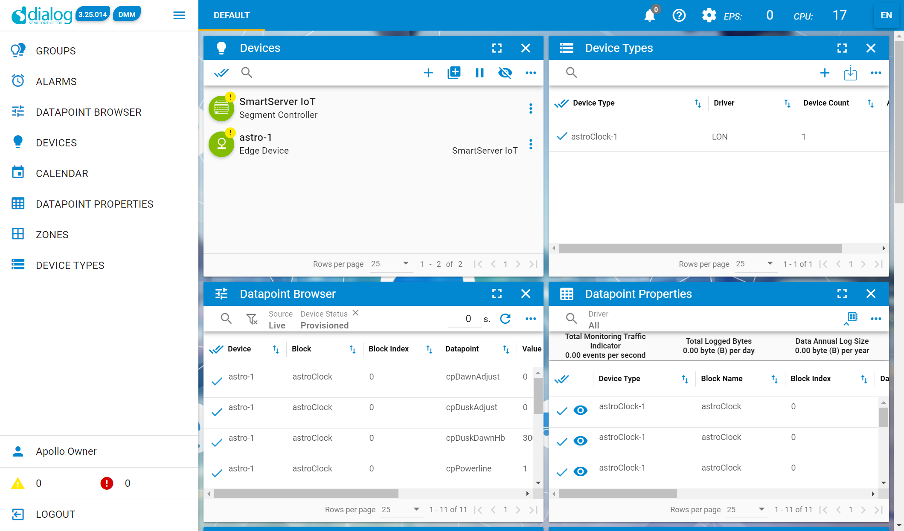

# astroClock.js
This application provides time, sunrise, sunset, dusk, and dawn times to share with edge devices in outdoor lighting systems.  It applies to a class of devices that require knowledge of local time, and the local dusk and dawn times to schedule load control.  
## Release Notes
1.00.002 - Initial application release.  08/25/2021
## UFPTastroClock
This UFPT provides data points intended to align with Lon devices that understand SNVT_time_stamp, and SNVT_switch for direct control.  This functional block provides the functionality of the UCPTrealtimeClock found in SmartServer 2. The resources defining this interface are part of ApolloDev.typ 1.31 or higher.

| Network Variable | Type | Notes |
|--- | --- | ---|
|nvoAfterDark|SNVT_switch|Set to {value:100,State:0} between civil dusk and civil dawn|
|nvoDawn|SNVT_time_stamp|Time for today's civil dawn|
|nvoDusk|SNVT_time_stamp|Time for today's civil dusk|
|nvoSunrise|SNVT_time_stamp|Time for today's sunrise|
nvoSunset|SNVT_time_stamp|Time for today's sunset|
|nvoLocalTime|SNVT_time_stamp|Current local time|

This application uses the lat/lng coordinates of the segment controller.  You can determine the configure GPS location using the Device widget in the CMS, and reposition as necessary. 

These configuration properties are used to manage operation of this functional profile.
| CP | Type | Notes |
| --- | --- | ---|
|cpPowerLine|UCPTpowerLine|Default: 1, means the controller will throttle nvo traffic for Powerline.  Updates use a 30s throttle.|
|cpDawnAdjust|UCPToffsetSunrise|Default:0, +-30m adjustment to civil dawn time to adjust for local conditions.  Does not affect sunrise time.|
|cpDuskAdjust|UCPToffsetSunset|Default:0, +-30m adjustment to civil dusk time to adjust for local conditions.|
|cpTimeHb|SCPTmaxSendTime|Default: 300s, Time between updates to nvoLocalTime|
|cpDuskDawnHb|UCPTmaxSendTime|Default: 300s, Time between updates to daytime switching times.  The nvoAfterDark also follows this rate.|

Powerline requires special consideration to contol updates to the channel.  In systems requiring more than 3 hops, it is best practice to limit updates to every 300s.  This application will prevent offering channel updates for a configured throttle time when cpPowerLine is set to 1.

## Deployment Instructions
This procedure requires the SmartServer IoT to have access to the Internet to support npm package installation.  Please confirm by typing `ping -c3 npm.com` at the SSH prompt.
1. Power up the SmartServer, and confirm the CMS has fully started up.
2. Copy files is the folder `astroClock Deploy` to as USB flash drive.
3. Insert the drive in an empty USB port on your SmartServer.  
4. Type: `sudo ./setup [pwd]` where [pwd] is your apollo password.
Here is an example of the setup.sh output for successful installation. 
```
apollo@smartserver-17q5t6a:/media/usb0/astroClock$ sudo ./setup.sh ea1
AstroClock device installer
Using apollo password: ea1
Creating install directory /var/apollo/data/astroClock
Extracting files from archive
Archive:  ./astroClock.zip
  inflating: astroClock.conf
  inflating: astroClock.dtp
  inflating: astroClock.js
  inflating: package-lock.json
  inflating: package.json
Installing npm packages...
npm WARN astroclock@1.0.0 No repository field.

audited 1 package in 1.599s
found 0 vulnerabilities

Resetting file ownship to apollo
Moving astroClock package to /var/apollo/data/dtp-files.d
Loading astroClock package to the CMS as user/pwd apollo/ea1
CMS is ready.
Upload of dtp files complete.
Creating astro-1 lon.attach:local device
apollo@smartserver-17q5t6a:/media/usb0/astroClock$ pwd
/media/usb0/astroClock
apollo@smartserver-17q5t6a:/media/usb0/astroClock$
```

5. If you login to the SmartServer CMS, you will see the astro-1 device in the CMS Device widget.


5. Reboot your SmartServer.  
6. Allow 3 minutes and verify operation of the astroClock application by connecting by SSH and typing: `tail -f /var/log/supervisor/astroClock.log` You should expect output similar to this:
```
root@smartserver-17qanut:~# tail -f /var/log/supervisor/astroClock.log
astroClock.js - version: 1.00.002
Sunrise: 6:23:25 AM, Sunset: 7:29:06 PM
Dawn: 5:57:31 AM, Dusk: 7:54:56 PM
Allowing SIOT processes to initialize.  Sleep for: 180s
SmartServer SID: 17qanut
astro-1 - State: provisioned - Health: normal
8/25/2021, 2:30:22 PM - Dawn: 6:05:13 AM
8/25/2021, 2:30:22 PM - Dusk: 8:12:26 PM
8/25/2021, 2:30:22 PM - delayToSchedule: 45877443ms.
```
## Notes on Operation
The cpPowerline property defaults to 1.  This imposes a pacing delay for the nvo points to avoid congestion on the powerline channel.  The default is 20s, but the first command line parameter can override the pacing delay.  The installed `/etc/supervisor/conf.d/astroClock.conf`, is set to 30, which is generally a reasonable conservative value in a PL repeating environment.  

The `nvoAfterDark` point (`SNVT_switch`) will fire at the calculated nvoDawn and nvoDusk times with repective cpDawnAdjust and cpDuskAdjust offsets applied.  

The dawn and dusk positions are defined as 6 degrees below the horizon.  This is the generally accepted point to define the operation of outdoor lighting in most cases.

The installation script creates the internal device `astrp-1`.  If you delete the device in the CMS, you need to either re-run the setup script, or use the application `localDev.exe` (https://github.com/izot/smartserver-iot/tree/master/apps/localDev) to create it again.  It is critical to use the handle `astro-1` when creating the intenal device to implement this feature.  Here is what the command line needs to be:
 `localDev 90000106000A8511 astro-1 [SSIOT target IP address]`

 If you re-image your SmartServer, you need to re-deploy the astroClockPackage.zip using the setup.sh.  An apollo-reset normal, or configuration UI Reset Databases operation will require re-deployment of the astroClockPackage, or recreation of the astro-1 device using the localDev.exe application.

 Position changes of the SmartServer IoT Edge Server in the will force the recalculation of the solar events.


