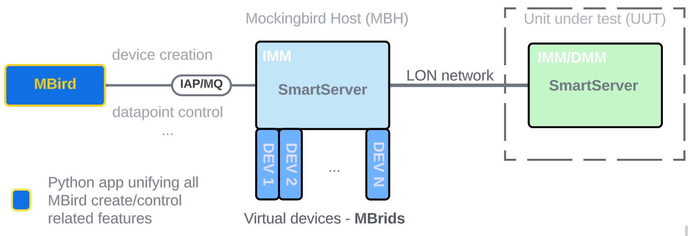

# Mockingbird - LON traffic generator

Mockingbird is a Python script that leverages IAP/MQ protocol to create and control Internal LON devices (ILDs). The script can be utilized for quality assurance purposes of the SmartServer system. In further text, the internal LON devices are called **MBirds** in order to reduce the possibility of confusion with other similar abbreviations.

MBirds have datapoints that reside on the SmartServer itself; in this case, we call this system Mockingbird Host (**MBH**). The MBirds' input datapoints are writable from the LonTalk network, and modifying the output datapoints produces data on the LonTalk network. MBirds can be created and provisioned, and their datapoints can be controlled as if they are actual physical devices. An example use case for this type of mechanism is to create MBirds, provision them on the unit under test (**UUT**), and generate load by modifying the MBirds' datapoints to observe and monitor the behavior under load of the unit under test.




#### Prerequisites

To create an internal device, you must first <u>import the corresponding XIF to the SmartServer using the Device Type widget, the CMS REST API or the DTP loader</u>.  Furthermore, when using IzoT Net Server with the SmartServer, the binary version of the resources needs to be added to your Lonworks/types folder.  It is also <u>required that the SmartServer be put into IMM mode</u> prior to instantiating internal devices using the script. In order to achieve external communication using the script, <u>MQTT ports (1883 and 8883) should be opened via the Features Configuration page</u> on the SmartServer web interface. Finally, the <u>SmartServer needs to be a Quad Core</u> (Serial number contains F or higher) and be running 3.64 or later.

#### Usage

MBird.py script can be used to create MBirds on the Mockingbird host. You can use it to instantiate a number of devices of a specific type and with proprietary handle names. The script can be run locally on the MBH or externally on a PC with access to the MBH network. 

After successful MBird creation, the script will generate .csv and .scr files that can be used for provisioning the devices through the CMS or in the NodeUtil tool. Note that the script will create a .csv and .scr files if they don't exist and append the lines to the existing files. To provision newly created MBirds on the UUT, just import the .csv in the CMS, select the devices that appear after importing, and click 'Provision Selected' in the Devices widget. 

The script's help guide can be accessed by running the  `python mbird.py -h` or `python mbird.py --help`

To create MBirds of a specific type and handle use the following command:  

```shell
python mbird.py -t <Target SmartServer IP> --hdl <Devices handle> -n <Number of devices> -x <Device type XIF id> -d <Device type> -i <LON interface>
```

- <Target SmartServer IP>  - IP of the Mockingbird host.  If not supplied, default is localhost.
- <Devices handle> - Base name of the MBirds to be created. Every unique MBird will have the base name and the device number in its name "<name>-<nr>". If the provided device handle is separated with the "-" followed by a number (e.g. , `m-tier2-50`), the MBird creation will start from the provided number and increment `n` times, where `n` is provided in the next argument. If there is more than one dash in the string, then the incrementing occurs after the last dash. For the example with `-n 10` the device handles would be: `m-tier2-50`, `m-tier2-51`, ..., `m-tier2-60`. 
- <Number of devices> - Number of MBirds to be created.  If not supplied, default is 1
- <Device type XIF id> - 16 character XIF identifier for the device type. If not provided the script will use the specified <Device type> with .xif appended after removing any "-<n>" suffix.
- <Device type> - Name of the device type used in the CMS. If not specified the script will use the provided <Device type XIF id> in the format "XIF-1". 
- <LON interface>  - name of the LON interface on the MBH to use when creating MBirds. Example `lon0`, `lon1`...

<u>Example:</u>

```shell
python .\mbird.py -t 10.100.40.215 --hdl STest-10 -n 5 -x 9FFFFF0501840460 -d 6kEvbMultiSensor -i lon0
```

The example command will create five devices, STest-10, STest-11, ..., and STest-14, of the EVB type and generate .csv and .scr files. Right after the creation of a single MBird, the script will try to change the MBird's channel from default `/~/-3` to whichever channel the LON interface is connected to. This enables the LON traffic of newly created MBirds to go through user-specified LON interfaces. 

Besides just the creation of MBirds, it's also possible to control them by creating service pin events and setting their health status to on or off.

<u>An example</u> of those features is demonstrated with the following command:

```shell
python mbird.py -t <Target SmartServer IP> --hdl EVB -n <Number of devices> -x <Device type XIF id> -d <Device type> --imm -c toggle -s --load
```

The example will first try to switch the SmartServer to the *Independent Management Mode* (IMM) specified by  the `--imm`  flag, then create the devices with the given handle if they don't exist. Based on the specified handle, it will select all of the devices that match the handle (all `EVB-x` devices) and toggle their health status (`-c toggle`) (available options: `true`, `false` and `toggle`); it will initiate the service pin event (`-s`) for all of the devices and proceed to update the selected datapoints in an incrementing fashion (`--load`).

Control from within the code of the device health is possible by creating the `dev_state_list` list of tuples within the script containing the exact device handle and the desired device state. Example:  `dev_state_list = [("TI-01", "false"), ("TI-02", "true"), ("TI-03", "toggle")]`

Disabling the devices or updating the devices' channel for a subset of devices is also possible. By using the `EVB-x` handle, it is possible to specify the start of the subset range, where `x` is the number of the first device. The script detects all of the MBirds with handle `EVB-x` where `x` < `n`,  creates them if they don't exist, or updates them based on new arguments accordingly.   
