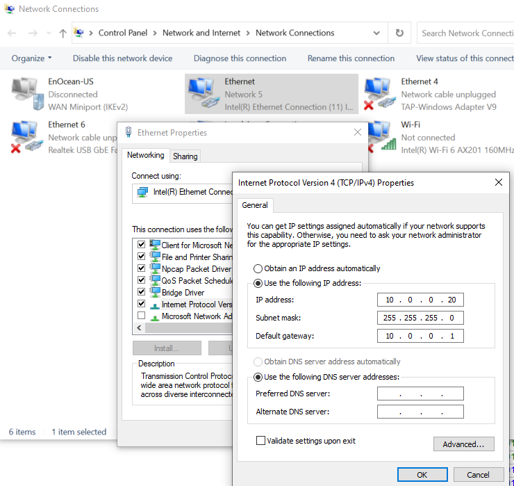
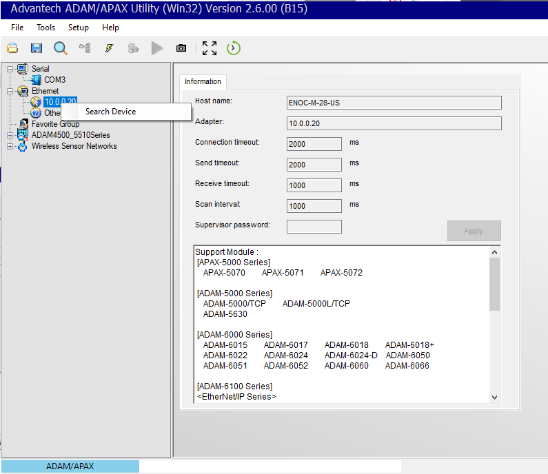
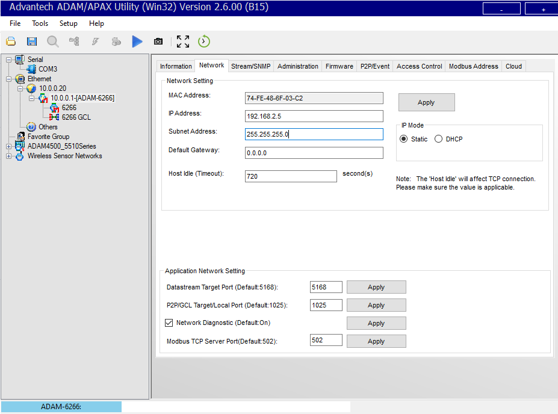

The Advantech Adam-6266 is an excellent choice for DIO interfaces for
outdoor lighting systems. This document describes the steps to integrate
this device with the SmartServer-IoT. These instructions were created
against Adam-6266 firmware version 6.11 B26, in factory default
condition.

1.  Configure your PC Ethernet adaptor to be on the with this static IP
    configuration:\
    

2.  Install this software from Advantech on your Windows PC: [Adam/Apax.
    Net Utility for ADAM/APAX series - Advantech Support -
    Advantech](https://www.advantech.com/en/support/details/utility?id=1-2AKUDB).
    This document was written when V2.06.00 B15, released 2022-07-26.

3.  Connect the Adam-6266 device to the Ethernet port configured with
    the 10.0.0.20 address.

4.  Launch the AdamApax .Net Utility.

5.  Right-click the Ethernet interface configure with the 10.0.0.20 and
    select Search Device:

6.  You should see the Adam-6266 device with the address.

7. Select the device that is discovered and then the 6266 child node.
Click the Channel tab and select the FSV (Fail Safe Values) to be ON.
Use the DO buttons to set the value. Click Apply FSV. Use the password
00000000 (8 zeros) when prompted.

8.  Select the ADAM-6266 parent node and click the Network tab in the
    main application frame. Use the configuration shown here and click
    Apply. This is the same subnet as the Eth1/WAN port of the
    SmartServer IoT. When you are prompted for the password use:
    00000000 (8 zeros)\
    

9.  Disconnect the Adam-6266 from the PC and connect to the SmartServer
    eth1/WAN port and apply power. Confirm in the SmartServer
    Configuration page that the network settings for the eth1/WAN port
    are as show here:\
    

10. Login to the CMS, import the supporting device type package
    ADAM-6266.dtp in Import/Export menu option. Wait until the device
    type Adam-6266 appears in the device widget.

11. Use the device widget to create this device and click Save:\
    

12. Use the device widget action menu to provision the DIO device.

You now have a device that can be scheduled to control power to the
streetlight segment by connection the N.0. output to D0 on the Adam-6266
module. If the SmartServer fails to keep the connection open with
continuous polling, the relay fails ON.

You may elect to use the N.C. connection and set the FSV to OFF. This
would give you an ON condition for the streetlight segment if you were
to lose power to both the SmartServer IoT and the Adam-6266 module.
